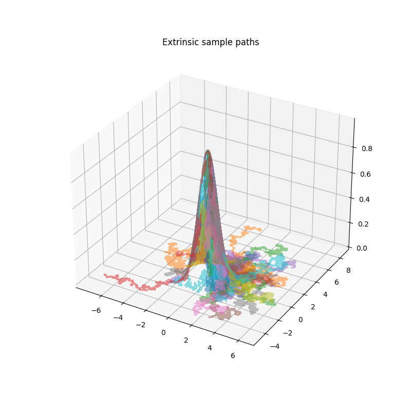

# ManifoldBm
This package provides functions concerning Brownian motion
and Langevin motion on manifolds. The following three
perspectives are available:

1. Symbolic computations
2. Simulations of sample paths
3. Estimation of the intrinsic metric tensor $g$

The symbolic computations and simulations can be done both
extrinsically and intrinsically, although the latter is usually
faster in both symbolic computations and in simulations since the
dimensions of the driving noise is smaller than it is in the extrinsic
setting. The estimations solely concern themselves with extrinsic sample paths
and recovering the intrinsic geometry from observing many paths.

## Installation

You can install the package via from github on windows in command line with:

``` 
python -m pip install git+https://github.com/shill1729/ManifoldBm.git
```

## Symbolic Computations
Here is a basic example for symbolic computations. We can
symbolically compute
1. The metric tensor
2. The orthogonal projection
3. The intrinsic and extrinsic drift coefficient
4. The intrinsic and extrinsic diffusion coefficient
```python
from ManifoldBm.ManifoldLearn import *
# Setting up the synthetic process
x, y, z= symbols("x y z", real=True)
F1 = x**2
f1 = F1-y
# Now we can set up an instrinsic BM
param = Matrix([x])
chart = Matrix([x, solve(f1, y)[-1]])
d = param.shape[0]
D = chart.shape[0]
dim = (D,d)
print("Extrinsic vs Intrinsic dim ="+str(dim))
print("Chart")
print(chart)
# Initialize the BM
bm = IntrinsicBm(param, chart)
print(bm)
print(bm.manifold)
    
```

## Simulating sample paths
While the code provided can simulate any autonomous SDE:
$$dX_t = \mu(X_t) dt+ \sigma(X_t)dB_t,$$
we shall demonstrate the pipeline for simulating BMs on manifolds.

```python
from ManifoldBm.ManifoldLearn import *
tn = 5
C = 0.2
a = -1
b = 1
nens = 1
npaths = 50
ntime = 5000
x0 = np.array([1, 1])

# Setting up the synthetic process
x, y, z = symbols("x y z", real=True)
F = exp(-x**2-y**2)
f = F - z
# Now we can set up an instrinsic BM
param = Matrix([x, y])
chart = Matrix([x, y, solve(f, z)[-1]])
d = param.shape[0]
D = chart.shape[0]
dim = (D, d)
print("Extrinsic vs Intrinsic dim =" + str(dim))
print("Chart")
print(chart)
bm = IntrinsicBm(param, chart)
print(bm)
print(bm.manifold)
drift, diffusion = bm.get_bm_coefs(d)
# Simulate an ensemble of sample paths
Y = sample_ensemble(x0, tn, drift, diffusion, npaths, ntime, d, d)
X = np.zeros((npaths, ntime + 1, D))
for i in range(npaths):
    if len(Y.shape) == 2:  # d=1 then ensemble is (n+1, N)
        X[i] = sample_path_coord(bm.manifold.param, bm.manifold.chart, Y[:, i])
    else:  # d>1 then ensemble is (N, n+1, d)
        X[i] = sample_path_coord(bm.manifold.param, bm.manifold.chart, Y[i])

fig = plt.figure(figsize=(8, 8))
for j in range(npaths):
    if D == 2:
        plt.plot(X[j][:, 0], X[j][:, 1], alpha=0.5)
    elif D == 3:
        ax = plt.subplot(projection='3d')
        ax.plot3D(X[j][:, 0], X[j][:, 1], X[j][:, 2], alpha=0.5)
plt.title("Extrinsic sample paths")
plt.show()

```
This should produce an image like


As obviously seen, if you can run lots of Brownian motions on an unknown manifold, 
you will eventually recover its geometry. In the next section we demonstrate this from
a slightly different perpsective.

## Estimation: Learning the metric tensor by running Brownian motions
A simple albeit inefficient algorithm to estimate the metric 
tensor of a manifold, having access to extrinsic sample paths, is
to simple take covariances of each pair of coordinates across the 
ensemble of paths, divide by the time horizon, and then perform an
eigendecomposition. The metric tensor can be recovered carefully through
the eigenvectors. See the paper (where?) for more details, but briefly,
the algorithm is as follows:

1. Observe $N$ sample paths of an extrinsic Brownian motion over a small time interval $[0,h]$ starting from a point $x\in \mathbb{R}^D$.
2. Approximate the orthogonal projection matrix $P$ as $\frac{1}{h} S$ where $S$ is the sample covariance matrix of the terminal values.
3. Compute the eigendecomposition of $P$. Let $v_1(x),\dotsc, v_p(x)$ be the eigenvectors associated to the $p=D-d$ smallest eigenvalues.
4. The Jacobian of the (assumed) function defining the chart $(x_1,\dotsc, x_d, F(x_1,\dotsc, x_d))$ can be recovered as $J_i= -\pi(v_i(x))^T/\pi_{d+i}(v_i(x))$, where $J_i$ is the $i$-th row of $J$. Here $\pi_{d+i}(v)$ is $d+i$-th coordinate of $v$, while $\pi(v)$ is the first $d$ coordinates of $v$.
5. The metric tensor at $y=\pi(x)$ is then $g(y)=I+J(y)^TJ(y)$.
```python
from ManifoldBm.ManifoldLearn import *

tn = 10**-6
C = 0.2
a = -1
b = 1
nens = 20
npaths = 20
ntime = 10
# 2D grid
x0, y0 = np.mgrid[a:b:nens * 1j, a:b:nens * 1j]
grid = (x0, y0)

# Setting up the synthetic process
x, y, z = symbols("x y z", real=True)
F = exp(-x**2-y**2)
f = F - z
# Now we can set up an instrinsic BM
param = Matrix([x, y])
chart = Matrix([x, y, solve(f, z)[-1]])
d = param.shape[0]
D = chart.shape[0]
dim = (D, d)
print("Extrinsic vs Intrinsic dim =" + str(dim))
print("Chart")
print(chart)
bm = IntrinsicBm(param, chart)
print(bm)
print(bm.manifold)
drift, diffusion = bm.get_bm_coefs(d)
fig = plt.figure(figsize=(6, 6))
synthetic_test2(param, grid, tn, bm, npaths, ntime, D, None, True)
plt.show();

```
This should produce an image like this:


